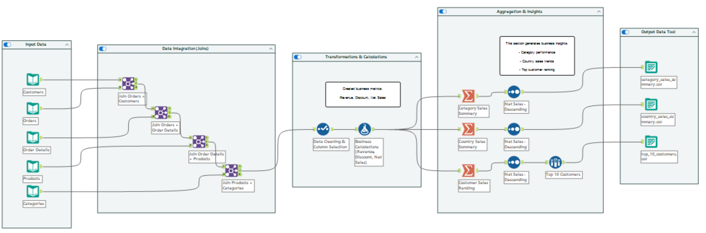
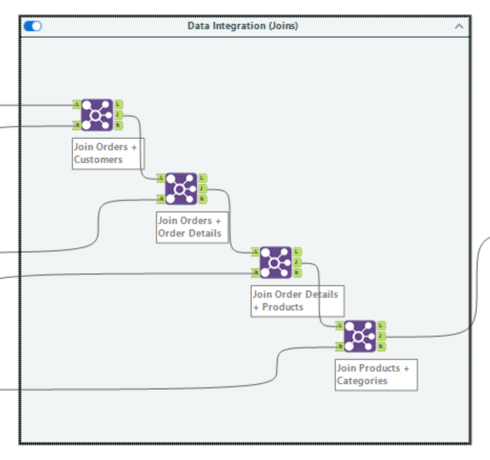
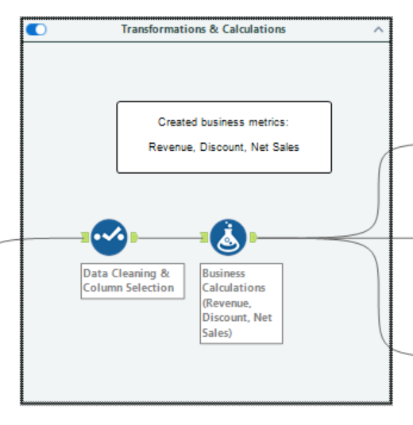
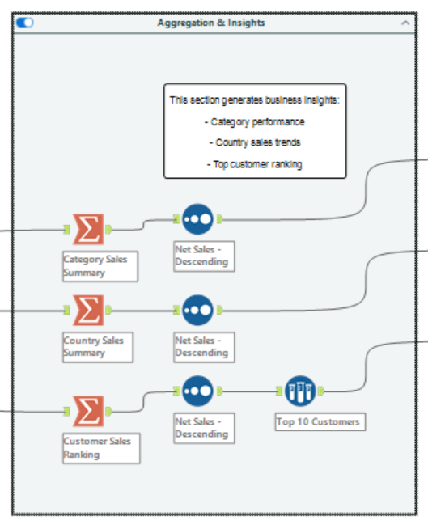
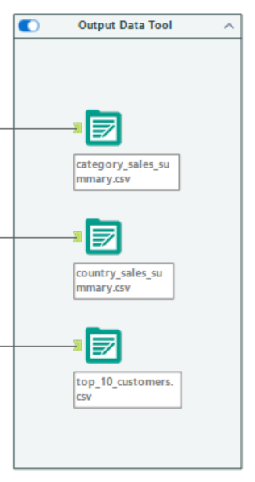

# 📊 Enterprise Data Pipeline using Alteryx

🚀 Built a structured ETL pipeline using **Alteryx** to integrate, transform, and analyze multi-source business data.

---

## 🎯 Objective

Design a scalable data pipeline to:

- Integrate multiple datasets  
- Apply business transformations  
- Generate meaningful insights  

This pipeline simulates a retail business scenario where sales data from multiple sources is integrated and analyzed to support decision-making.

---

## 📌 Business Value

- Identifies top-performing categories and regions  
- Highlights high-value customers  
- Enables data-driven decision-making

---

## 🛠️ Tools Used

- Alteryx Designer  
- Data Cleaning & Transformation  
- Join Operations  
- Aggregation & Filtering  

---

## 🧱 Workflow Architecture

Input → Data Integration → Transformation → Aggregation → Output

---

## 📷 Workflow Overview



---

## 🔗 Data Integration (Joins)



- Sequential joins across multiple datasets  
- Built unified data pipeline  

---

## 🧮 Transformation Layer



Created business metrics:

- Revenue = UnitPrice × Quantity  
- Discount = UnitPrice × Quantity × Discount  
- Net Sales = Revenue − Discount  

---

## 📊 Aggregation & Insights



Generated insights:

- Category-level sales performance  
- Country-level sales distribution  
- Top 10 customers  

---

## 📤 Output Layer



Generated datasets:

- category_sales_summary.csv  
- country_sales_summary.csv  
- top_10_customers.csv  

---

## 📁 Project Structure

```
enterprise-data-pipeline-alteryx/
│── images/   → workflow screenshots  
│── data/     → dataset information  
│── docs/     → project explanation  
│── README.md  
```

---

## ⚠️ Note

The Alteryx workflow file (.yxmd) is not included due to system restrictions.

Screenshots and documentation fully represent the workflow.

---

## 🚀 Key Highlights

- ✅ End-to-end ETL pipeline design  
- ✅ Multi-source data integration  
- ✅ Business metric creation  
- ✅ Insight generation  
- ✅ Production-style output  

---

## 🧠 What This Project Demonstrates

- Data Engineering (ETL pipelines)  
- Data Transformation  
- Analytical Thinking  
- Alteryx Expertise  

---

## 🔮 Future Improvements

- Cloud integration (Azure)  
- Scheduled automation  
- Integration with Power BI dashboards  

---

⭐ If you found this useful, consider starring the repository!
